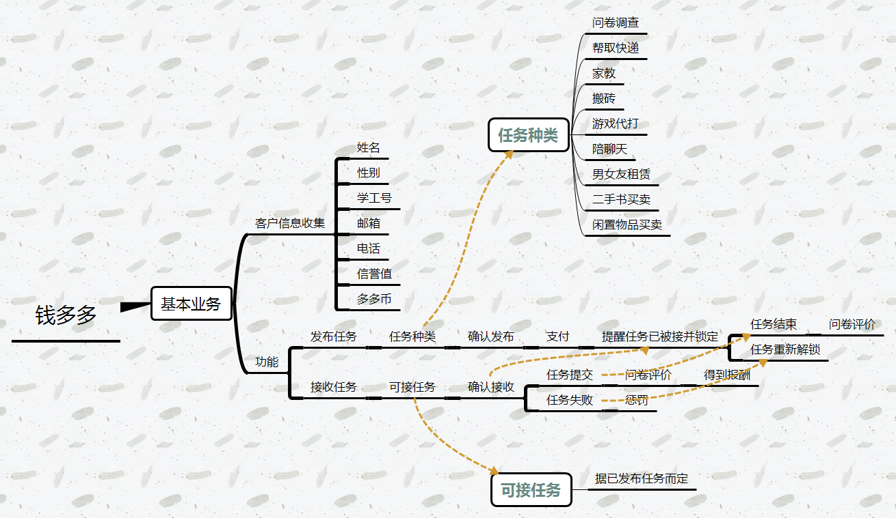

# 软件工程项目组uml163会议记录 
　　
* 例会时间：2019年3月20日 星期三 20:00-21:00
* 例会地点：明德园2号文化室
* 例会主持：周芙蓉 
* 会议记录：陈大朋
## 会议整体流程
* 一、签到
* 二、团队评分方案制定
* 三、项目商讨
* 四、其他事项

## 会议详细记录
#### 一、签到
* 组长：周芙蓉
* 组员：徐崧洋 陈大朋 朱满 吴庆

#### 二、团队评分方案制定
##### 
	  组内评分规则
      个人单次积分= 个人单次平均分 * 难度系数；
      个人积分 = 本学期个人单次积分总合；
      个人分数 = 个人积分/全体成员积分综合 * 总分；
##### 说明：
* 平均分：团队成员各人参考Github及平时具体贡献，由团队内其他全体进行评分,计算所有评分的平均分即个人单次平均分
* 难度系数：由全体成员一致评定报告人该次工作对于该报告人的难度系数。
* 总分：授课教师给予团队进行分数分配的总分数。

#### 三、项目商讨
##### 
		项目主题设定：钱多多
		项目基本业务：发布任务、接收任务
		任务种类商讨：问卷调查、拿取快递、家教、游戏代打
		功能流程商讨：用户登录、发布（接收）任务、提交订单、完成任务、问卷调查

#### 四、其他事项
* 以后开会至少提前一天通知，且每次会议至少四人参加      
* 请大家随时关注Github项目的动向
* 例会记录工作安排。思维导图：徐崧洋  会议记录：陈大朋

## 会议总结
* 本次会议全员到齐
* 确定了项目的大体方向
* 简单分配了短期任务
* 确立了项目的得分细则及后续会议的基本要求

